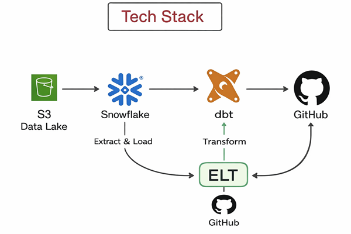

# Airbnb-End-To-End-Data-Engineering-Project-with-DBT-Snowflake-AWS
## Project Overview
Built an end-to-end data engineering pipeline using AWS, Snowflake, dbt, and Git, implementing incremental data loads and Medallion Architecture (Bronze, Silver, Gold). Developed scalable data models and automated transformations to deliver analytics-ready datasets.

## 🏗️ Architechture

Source Data (CSV) → AWS S3 → Snowflake (Staging) → Bronze Layer → Silver Layer → Gold Layer
                                                           ↓              ↓           ↓
                                                      Raw Tables    Cleaned Data   Analytics
